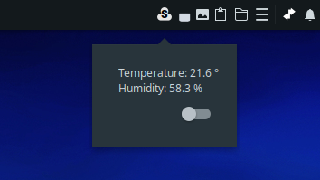
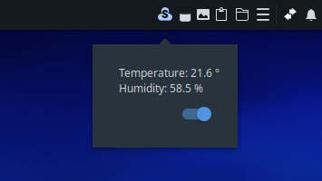
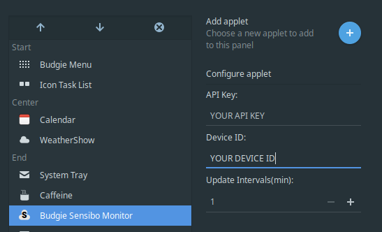

# budgie-sensibo-monitor - WIP

   ### Information
   A very simple budgie applet to display temperture and humidity, also on/off switch
   
   ### Screen Shots
 



   ### Installl
   Use the provided install.sh script or use the below bash commands

  ```bash
   $ cd budgie-sensibo-monitor
   $ mkdir build && cd build
   $ meson --buildtype plain --prefix=/usr --libdir=/usr/lib
   $ sudo ninja install
  ```

   ### Uninstall
   Use the provided uninstall.sh script or use the below bash commands

  ```bash
   $ sudo ninja uninstall
  ```
